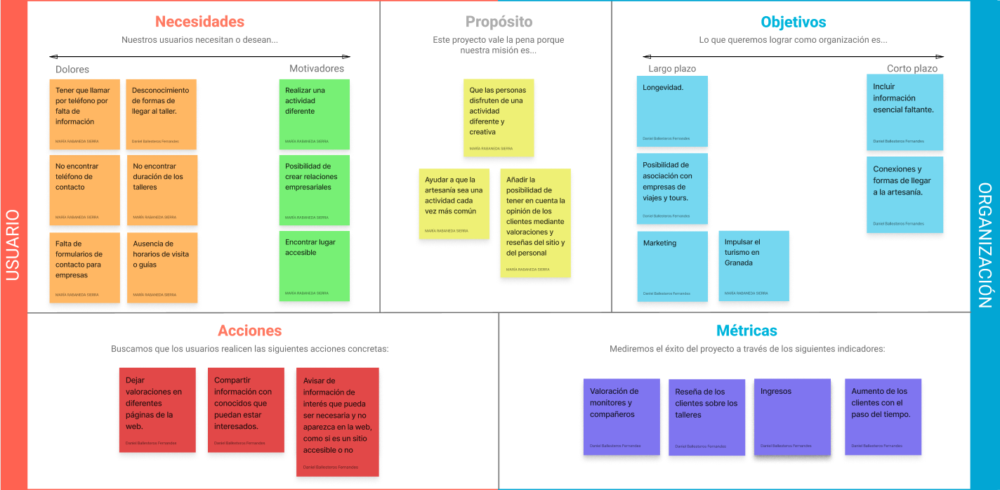
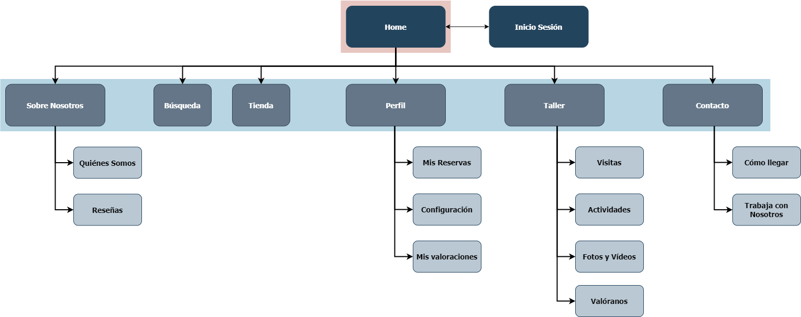

## DIU - Practica2, entregables

### Ideación 
* Point of View 

User | Need | Insight    
| ------------- | ------- | ----------
Hombre de 24 años con perfil de empresario. | Encontrar en la web alguna forma de comunicarse con la empresa. | El hombre busca una forma de ponerse en contacto con la artesanía como representante de su empresa para establecer algún tipo de negocio con ella, pero no encuentra una forma específica de hacerlo más que la opción existente abierta para todos los públicos.
Hombre de 24 años con perfil de empresario. | Encontrar los diferentes horarios que se ofertan para la guía turística en la Artesanía | El hombre trata de buscar los horarios de las visitas posibles para obtener más información del tiempo que duran las mismas y cada cuánto se hacen, pero no es capaz de verlo claramente ni siquiera simulando una reserva desde la web.
Mujer de 67 años jubilada y viajera. | Necesita que la página le proporcione información sobre cómo llegar al taller. Las conexiones de transporte público que existen para el sitio. | La usuaria necesita saber a ciencia cierta todas las posibilidades de transporte que hay tanto para llegar al sitio como para volver. En su plan de viaje necesitan saber horarios exactos para coger autobuses y poder volver a su pueblo tranquilas. Sin embargo, en la página web no aparece información de este estilo.
Mujer de 67 años jubilada y viajera. | Encontrar información sobre si existen o no facilidades para personas con discapacidades físicas. Por ejemplo para gente que use silla de ruedas o personas con discapacidades auditivas.  | Ella y su grupo de amigas pueden llegar a necesitar que el establecimiento donde se realizan los talleres sea accesible. Además, es importante que el servicio (wc)  sea adecuado, suficientemente amplio y esté cerca de donde van a realizar el taller. Es importante encontrar este tipo de información en la web, ya que es decisivo para que esta usuaria elija esta compañía.

### PROPUESTA DE VALOR
* ScopeCanvas

### TASK ANALYSIS

* User Task Matrix 

Haremos uso de una matriz de tareas dado que es más organizado y menos lioso para identificar los distintos grupos y hacer el análisis de las diferentes tareas que llevarán a cabo dentro de la web con la empresa del taller. En ella aparece la frecuencia de uso de cada usuario bajo la medida de:

H: High -
M: Medium -
L: Low

|  | Individuos | Grupos | Contratantes | Asistentes |
|:----------:|:----------:|:----------:|:----------:|:----------:|
| **Buscar información del taller**    | H   | H   |    |
| **Solicitar ayuda**    | L   | M   | M   |
| **Dejar reseña**       | M   | L   |     | L
| **Dejar valoración**   | M   | L   |     | M
| **Reservar visita**    | H   | M   | H   |
| **Cancelar visita**    | L   | M   | L   |
| **Cambiar visita**     | L   | M   | L   |
| **Modificar reserva**  | L   | M   | M   |
| **Reservar dinámicas de grupo**    | M   | H   |    | M
| **Guías turísticas**    | L   | M  |    | M

* User/Task flow

A partir de nuestro caso de estudio hemos razonado quiénes podrían ser potencialmente los principales tipos de clientes que acudirían a la web. Hemos identificado dos tipos principales: empresas y usuarios.

Los usuarios usarán la web con la finalidad de consultar información, así como gestionar y reservar por su cuenta aquello que le interese y gestionar personalmente sus acciones. Serán capaces de reservar visitas a la artesanía, buscar conexiones para llegar fácilmente al taller, dejar reseñas o contactar con la empresa. Dentro de éste grupo debemos distinguir dos categorías distintas:

Individuos, o grupos de pocas personas como familias pequeñas, fáciles de gestionar.
Grupos, como amigos, viajes del imserso... Grupos más grandes que requieren de mayor gestión y organización, dado que pueden ocupar la visita al taller en su completitud o casi.

Las empresas tendrán tareas distintas a los usuarios individuales, ya que estarán más familiarizadas con la empresa y el taller y facilitarán a otros usuarios o grupos información o reservas mediante un flujo algo diferente al del individuo. Dentro de este grupo destacamos:

Contratantes, siendo la parte de la empresa que funciona como intermediario entre la persona que asiste al taller y la artesanía.
Asistentes, siendo aquellas personas que hacen uso de la empresa para conocer  asistir al taller.

### ARQUITECTURA DE INFORMACIÓN

* Sitemap 

* Labelling 

| Etiqueta | Descripción |
|:----------:|:----------:|
| Home    | Página principal del sitio, se presenta la web de manera estándar.   
| Inicio Sesión    | Permite a los usuarios registrarse o acceder a su cuenta con el fin de poder usar la web más allá de las funcionalidades básicas.   
| Sobre Nosotros      | Muestra información sobre la artesanía, así como el taller.   
| Búsqueda  | Forma de navegar por la web mediante una búsqueda personalizada.   
| Tienda    | Tienda del taller, donde se ofrecen artesanías a la venta.   
| Perfil   | Información del usuario: nombre, correo, contraseña, feedback... Se puede configurar también aspectos como la interfaz, tamaño de texto…   
| Taller    | Taller de artesanía. Lugar en el que se puede gestionar todo lo referente a las visitas, actividades y valoraciones del lugar.   
| Contacto  | Formas de contacto con el taller.   
| Quiénes Somos   | Información más extensa recogida sobre el lugar, artesanos, monitores…   
| Reseñas    | Reseñas del lugar, referente al taller.  
| Mis Reservas    | Apartado de gestión de reservas de cada user, donde podrá modificarla, cancelarla…   
| Configuración      | Apartado configurable de cada usuario.   
| Mis valoraciones   | Feedback aportado por el usuario, ya sean valoraciones o reseñas.   
| Visitas    | Visitas a la artesanía y reservas para acudir.   
| Actividades    | Actividades gestionadas por el taller.   
| Fotos y Vídeos     | Galería que muestra el taller y lo que se hace en el lugar.   
| Valóranos  | Apartado para valorar el taller.   
| Cómo llegar    | Formas de llegar para mejorar la comunicación con la artesanía.   
| Trabaja con Nosotros    | Formulario para empresas externas a la artesanía interesados en trabajos conjuntos.   

### Prototipo Lo-FI Wireframe 

### Conclusiones  
En este paso hemos aprendido a hacer una propuesta de diseño de manera correcta. Gracias a la tabla del POV, hemos podido correlacionar los usuarios ficticios de la primera práctica como base de partida para el diseño de la aplicación. El Canvas nos ha proporcionado una visión más general de lo necesario y como enfocar el desarrollo del diseño, y mediante el Sitemap lo hemos organizado para posteriormente realizar algunos bocetos de nuestras ideas para la web. Cada paso es esencial a la hora de la propuesta del diseño, siendo de vital importancia sentar unas abses sólidas de cara a diseñar una aplicación bonita, con sentido y coherente.
