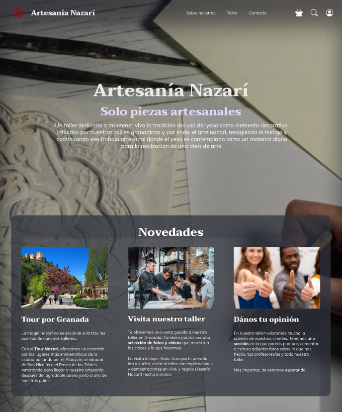

# DIU - Practica 3, entregables

## Moodboard (diseño visual + logotipo)   
Contamos con un Moodboard como punto de partida para delimitar algunos aspectos de los bocetos
HiFi posteriores de nuestra web. En él se definirán detalles como los iconos, el logo representativo, la
paleta de colores o la tipografía, los cuales se definirán a posteriori en la sección de Guidelines.
A su vez se aportarán algunas imágenes inspiradoras que nos han llevado a tomar algunas decisiones:

## Landing Page
Aquí vamos a presentar la landing page correspondiente a nuestro proyecto. La misma será la
página principal de acceso a cualquier visitante a nuestra web, la cual contará con algunos
aspectos importantes a tener en cuenta:
* Un título (y subtítulo) sugerentes y motivadores sobre la propuesta de diseño. Debe
transmitir un mensaje claro y atrayente para aquel que lo lea.
* Algún elemento gráfico de refuerzo (imagen/vídeo) que de fuerza a la idea que
representamos. Optamos por incluirla como una imagen de fondo que reivindica un
proceso artesanal adecuado con el contexto de la web.
* Varias acciones y anuncios que llamen la atención y motiven al usuario a seguir
indagando en la web.

## Mockup: LAYOUT HI-FI
A continuación, se procederá a presentar los diferentes bocetos de alta calidad resueltos por el
equipo para la presentación del proyecto en formato móvil. Los mismos cuentan a su vez con una versión para web, 
que puede visualizarse en la práctica anterior o en la página inicial de nuestro proyecto.

## Documentación: Publicación del Case Study
Para el caso de estudio de nuestra aplicación, procederemos a facilitar un - [video](https://drive.google.com/file/d/1a8KWVYeLyN3DoRkHZNeWks9Y2e_UtE1p/view?usp=share_link) en el que se muestra la aplicación, así como los diferentes user flows del que disponen los bocetos de alta calidad.
- [Enlace para visualizar el video](https://drive.google.com/file/d/1a8KWVYeLyN3DoRkHZNeWks9Y2e_UtE1p/view?usp=share_link)

## Valoración
Con esta práctica nos hemos dado cuenta de la importancia de seguir los patrones de diseño para diseñar 
cualquier interfaz. Además, de lo difícil que resulta cambiar el enfoque al pasar de web a móvil, al tener
que comprimir la información en tan poco espacio. Colocar elementos de forma aleatoria según nuestro propio 
criterio tiene parte de creatividad, pero se necesita seguir las pautas de lo que está medianamente estandarizado. 
Hemos encontrado dificultades a la hora de ejecutar ciertos efectos en Figma, ya que no hay gran manejo aún de la
herramienta, pero hemos sabido resolverlo lo mejor posible. En conclusión, ha sido una práctica muy importante y enriquecedora.
 
