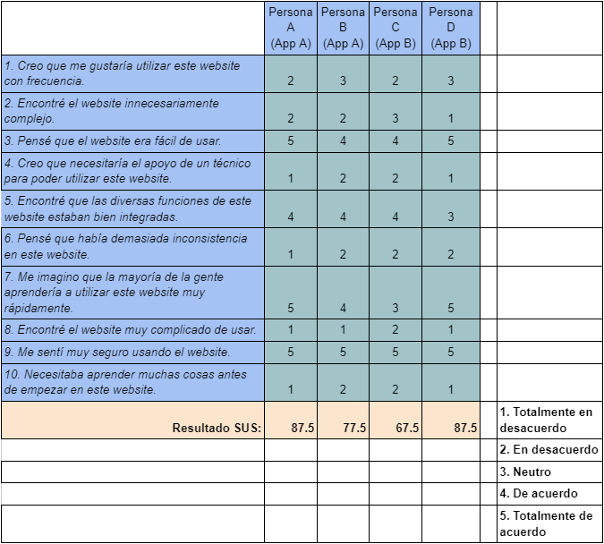
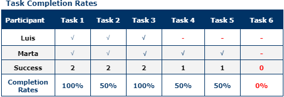

# DIU - Practica 4, entregables

## Users 

Para el desarrollo de la práctica se usará el método de Role Playing, y se crearán 4 perfiles ficticios de manera aleatoria siguiendo las indicaciones de la guía de la práctica. Así se crearán 4 usuarios que representarán a las personas que acceden a la aplicación. (2 para la aplicación A, y 2 para la B).

- **Persona A** → (1, 6, 5.) Javier es un profesor de pilates de 26 años de edad, bastante tranquilo y espiritual. Tiene un nivel intermedio en el manejo de tecnologías con el que se puede defender, aunque a pesar de ello reniega bastante de ellas, disgustándole.

- **Persona B** → (4, 5, 3.) Alberta es una persona mayor de 65 años, jubilada. A pesar de disponer de una discapacidad física debido a un accidente en el que perdió una pierna, no le gusta limitarse y le encanta viajar, siendo feliz así.

- **Persona C** → (2, 4, 6.) Luis es un abogado, padre de familia, cuyo día a día es un constante ajetreo por su trabajo, labores del hogar y crianza de sus hijos. Se siente algo triste por su falta de tiempo libre.

- **Persona D**→ (5, 1, 1.) Marta es una joven empresaria de 33 años de edad. A pesar de estar absorta en su trabajo, disfruta mucho moviéndose y pasar los domingos en el campo o la montaña. Está cabreada con el aumento de los precios recientemente de cara a sus vacaciones.

| Usuarios | Sexo/Edad     | Ocupación   |  Exp.TIC    | Personalidad | Plataforma | TestA/B
| ------------- | -------- | ----------- | ----------- | -----------  | ---------- | ----
| Javier  | H / 26 | Profesor de Pilates | Intermedio  | Amargado     | Móvil.     | A 
| Alberta | M / 65 | Jubilada            | Bajo        | Feliz        | Web.       | A 
| Luis    | H / 45 | Abogado             | Bajo        | Emocional    | Móvil.     | B 
| Marta   | M / 33 | Empresaria          | Avanzada    | Temperamental| Web.       | B 

## A/B Testing. 

En este apartado se realizarán diversas encuestas de usuario para conocer mejor el impacto de la aplicación en diferentes perfiles. Se usará el “Sistema de Escalas de Usabilidad (SUS)” para medir la usabilidad del mismo y establecer una valoración orientativa para saber cómo encauzar el proyecto.

Tras obtener el resultado SUS de cada valoración, se obtiene una media aritmética de **82.5** para la **App A**, y de **77.5** para la **App B**, con lo que siguiendo la escala expuesta con anterioridad podemos decir que es un resultado aceptable al ser valores superiores a 68, que es el puntaje promedio a partir del cuál estipulamos que el resultado es aceptable, es decir, se va por el buen camino.

Para la elaboración del cuestionario SUS, se ha intentado imaginar cómo los diferentes roles se aplican teniendo en cuenta los conocimientos, estados de ánimos o situación, para representar al máximo posible una situación real, por ende los resultados pueden estar influenciados por el tipo de usuario que puntúe la aplicación, siendo algo orientativo.

Los resultados de Artesanía Nazarí se deben a que hemos intentado realizar una aplicación cohesionada, simple e intuitiva. El arte y la ambientación agasaja a aquellos que entran en la web, quedándose prendados por su sencillez y por las opciones que ofrece, descubriendo un mundo completamente nuevo. Tanto usuarios experimentados como novatos pueden moverse sin problema usando las opciones que la misma proporciona.

La aplicación B a pesar de tener resultados inferiores a la A, cuenta con una puntuación aún aceptable. Se destaca la sencillez y la utilidad de la misma, aunque las ideas presentadas son algo redundantes con otras en el mercado. A pesar de que el contraste ayuda a las personas con problemas visuales, el color puede resultar poco atractivo para cierto público.

Ambas aplicaciones son difíciles de comparar, pues tratan temas diferentes siendo uno, la Artesanía Nazarí, y el segundo, una aplicación para encontrar el lugar perfecto para comer. Ambas tienen sus puntos fuertes y débiles, aunque los usuarios ficticios han preferido la aplicación A en términos generales, quizás por la presentación y el seguimiento de los guidelines adecuados.

## Usability Report

Evaluación de usabilidad de la aplicación B. Hemos creado un mini-informe con los datos obtenidos para la aplicación B del A/B testing y así como recomendaciones de mejoras. En él se encuentra un análisis que incluye una descripción del website, un resumen sobre cómo hemos procedido, la metodología que hemos utilizado, de nuevo los perfiles de los usuarios, y finalmente unos apartados que contienen los resultados de las evaluaciones, junto con nuestras conclusiones y recomendaciones.

### Descripción del Website

RestaurApp se trata de una página turística para la recomendación de los mejores lugares para comer y cenar en tu ciudad. La página principal contará con una barra de búsqueda y un selector del tipo de comida que le apetece al usuario. Una vez seleccionada, se le mostrarán las opciones mejor valoradas alrededor de su zona.

También existirá un mapa de la ciudad que mostrará los restaurantes por ubicación.

### Resumen ejecutivo.

El propósito principal de este informe es examinar y detectar las deficiencias de la aplicación en términos de usabilidad, llevando a cabo una prueba de usabilidad mediante la participación de diversos tipos de usuarios en la interacción con el sistema. Para este fin, se usará el método de Role Playing, y se crearán 4 perfiles ficticios de manera aleatoria siguiendo las indicaciones de la guía de la práctica. Así se crearán dos usuarios que representarán a las personas que acceden a la aplicación (aparecerán como usuarios C y D ya que los usuarios ficticios A y B estaban asignados a evaluar nuestra aplicación, no la que estamos evaluando en este report):

- **Persona C** → (2, 4, 6.) Luis es un abogado, padre de familia, cuyo día a día es un constante ajetreo por su trabajo, labores del hogar y crianza de sus hijos. Se siente algo triste por su falta de tiempo libre.

- **Persona D** → (5, 1, 1.) Marta es una joven empresaria de 33 años de edad. A pesar de estar absorta en su trabajo, disfruta mucho moviéndose y pasar los domingos en el campo o la montaña. Está cabreada con el aumento de los precios recientemente de cara a sus vacaciones.

A través de esta prueba, se han identificado algunos defectos que se abordarán en detalle más adelante. Este informe proporciona información sobre la reacción de los usuarios después de interactuar con el sistema, la complejidad de las tareas realizadas, los errores identificados y las recomendaciones para mejorarlo.

### Metodología

Al llevar a cabo el test de usabilidad, el primer paso ha sido identificar usuarios realistas para evaluar la aplicación. Una vez que los usuarios han sido identificados, determinaremos cómo interactuarán con la aplicación al realizar diversas tareas. Para cada tarea planteada, se asigna un valor numérico del 1 al 5, teniendo en cuenta los siguientes aspectos:

- La facilidad de encontrar la información solicitada desde la vista principal.
- La precisión al predecir en qué sección de la aplicación se encuentra la información.
- La capacidad de identificar en qué punto del sistema se encuentran.

Una vez completada esta etapa, los usuarios deben responder a un cuestionario SUS con el objetivo de obtener una evaluación global de la aplicación. Gracias a  esta última tarea, se han extraído una serie de conclusiones en relación a:

- Los defectos en la interfaz de la aplicación.
- Qué contenido resultó más interesante para cada usuario.
- Las recomendaciones de mejora.

#### Participantes

| Usuarios | Sexo/Edad     | Ocupación   |  Exp.TIC    | Personalidad | Plataforma | TestA/B | SUS Score 
| ------------- | -------- | ----------- | ----------- | -----------  | ---------- | ------- | --------
| Luis    | H / 45 | Abogado             | Bajo        | Emocional    | Móvil.     | B       | 67.5
| Marta   | M / 33 | Empresaria          | Avanzada    | Temperamental| Web.       | B       | 87.5

#### Evaluación de tareas /escenarios

A continuación, hemos analizado la realización de diferentes tareas por parte de cada uno de los usuarios definidos anteriormente:
1. Buscar un restaurante concreto.
2. Llegar al perfil de usuario.
3. Ver restaurantes populares.
4. Acceder a una red social vinculada.
5. Visualizar el mapa con los distintos restaurantes.
6. Poner una valoración del sitio.

#### Cuestionario SUS

Para la elaboración del cuestionario SUS, se ha intentado imaginar cómo los diferentes roles se aplican teniendo en cuenta los conocimientos, estados de ánimos o situación, para representar al máximo posible una situación real, por ende los resultados pueden estar influenciados por el tipo de usuario que puntúe la aplicación, siendo algo orientativo.

*1. Totalmente en desacuerdo*
*2. En desacuerdo*
*3. Neutro*
*4. De acuerdo*
*5. Totalmente de acuerdo*

#### Conclusión

Tras obtener el resultado SUS de cada valoración, se obtiene una media aritmética de 77.5 para la App B, con lo que siguiendo la escala expuesta con anterioridad podemos decir que es un resultado aceptable al ser una valoración superior a 68, que es el puntaje promedio a partir del cuál estipulamos que el resultado es aceptable, es decir, se va por el buen camino.

La aplicación B cuenta con una puntuación aún aceptable. Se destaca la sencillez y la utilidad de la misma, aunque las ideas presentadas son algo redundantes con otras en el mercado. A pesar de que el contraste ayuda a las personas con problemas visuales, el color puede resultar poco atractivo para cierto público.

Respecto a la paleta de colores, cabría decir que han tenido en cuenta el contraste de los usados en favor de personas con algún problema visual. Las tonalidades son llamativas a la par que apacibles por lo que llaman la atención sin ser una molestia para la vista, cosa que se agradece.

Además, el mockup de la aplicación se sigue bien de forma intuitiva y tiene una interfaz clara a los usuarios. Se podría haber mejorado siguiendo algunos guidelines de google bastante intuitivos, como el carousel para ganar espacio de pantalla o hacer mejor visible el menú.

