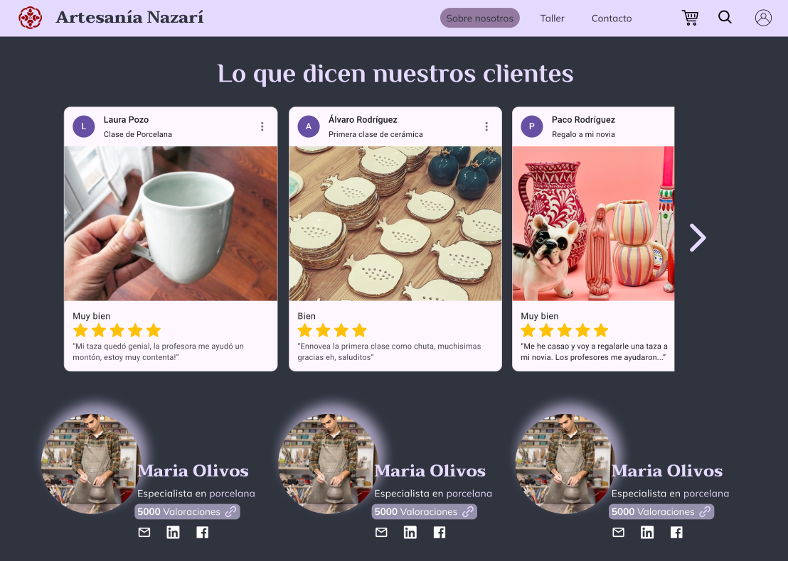

# DIU23
Prácticas Diseño Interfaces de Usuario 2022-23 (Tema: Artesanía Nazarí ) 

Grupo: DIU3_01Wachiturros.  Curso: 2022/23 
Updated: 24/03/2023

Proyecto: 
>>> Artesanía Nazarí

Descripción: 

>>> Nuestra propuesta se trata de una aplicación web que tiene como objetivo facilitar y esclarecer de la mejor manera posible la oportunidad de exponer e informar de las posibilidades que ofrecen talleres de Artesanía como el Nazarí. De esta manera se busca completar información esencial así como mejorar la presentación que se expone en la web original, dándole más accesibilidad y una cara más amigable cada vez que un nuevo visitante alcance la web de la empresa, así como incluir algunas funcionalidades que nos parece básicas para una web de la temática que se maneja, exprimiendo al máximo las posibilidades de la empresa.

Logotipo: 

Miembros
 * :bust_in_silhouette:   Daniel Ballesteros Fernandes     :octocat:     
 * :bust_in_silhouette:  María Rabaneda Sierra     :octocat:

----- 

# Proceso de Diseño 

## Paso 1. UX Desk Research & Analisis 

 1.a Competitive Analysis
-----

Si observamos las diferentes opciones de artesanía presentes en la ciudad, vemos como Artesanías Nazarí es una de las mejores, más aclamadas y que ofrecen más posibilidades entre las que se tienen en cuenta. Artesanías Nazarí ofrece más variedades, así como mejores servicios de manera aparente que su competencia. Por ello y por todos los apartados que se incluyen en la comparativa, resaltando la posibilidad de reservas, la información y las visitas, se toma como mejor opción las Artesanías Nazarí.
 

 1.b Persona
-----

**Jose Luis** es una persona interesante para poner en este contexto. Es un perfil moderno capaz de amoldarse a situaciones de la juventud de hoy día lo que puede ser interesante, de la mano con su condición de empresario.

La segunda persona creada es **Dolores**, una mujer de 67 años que vive en un pueblo y tiene una vida clásica y familiar. Creemos que es una buena elección, ya que es un perfil que no va a tener altos conocimientos en tecnología, y que además es mayor, por lo que puede tener unas limitaciones que no se suelen tener en cuenta.

 1.c User Journey Map
----

## Jose Luis
* Está interesado en abrir un espacio dentro de su agencia de viajes que incluya visitas a lugares de interés en Granada cuando mande a gente allá, sin embargo tiene problemas para contactar con la empresa por desconocimiento de alguna información que no aparece en el portal del taller, acabando nervioso. Creemos que es una situación capaz de darse más de una vez con alguien de su perfil.

## Dolores
* Lola lleva un tiempo sin viajar, y está organizando un viaje a Granada con sus amigas. Una de ellas propuso buscar algo relacionado con la artesanía. Todas estuvieron de acuerdo, y comenzaron su búsqueda por los sitios más famosos e interesantes. La situación de Lola tiene una parte que no es común, ya que las personas de más edad no suelen viajar solas, ni organizar viajes solas; pero por otro lado sí es común buscar las necesidades que se plantean con su personaje.

 1.d Usability Review
----
 - Enlace al documento:  [Link](https://drive.google.com/file/d/1SF2Jma2P_A_lChiHQG2X5fw2u0Ill52i/view?usp=sharing)
 - Valoración final (numérica): 51 - Moderate
 - Comentario sobre la valoración:  Como podemos observar, la valoración final ha sido de un 51/100, lo cual nos confirma lo ya comentado anteriormente, que tiene muchos fallos en cuanto a su diseño. Aún así, no es catastrófica, y lo hemos podido ver a la hora de compararla con otras páginas competidoras las cuales también dejan que desear. La interfaz web es un campo en este sector aún por explotar, y el cual no da buena imagen a las empresas, o al menos, la que deberían tener.

## Paso 2. UX Design  

 2.a Feedback Capture Grid / Empathy map / POV
----

>>> POV

 User | Need | Insight    
| ------------- | ------- | ----------
Hombre de 24 años con perfil de empresario. | Encontrar en la web alguna forma de comunicarse con la empresa. | El hombre busca una forma de ponerse en contacto con la artesanía como representante de su empresa para establecer algún tipo de negocio con ella, pero no encuentra una forma específica de hacerlo más que la opción existente abierta para todos los públicos.
Hombre de 24 años con perfil de empresario. | Encontrar los diferentes horarios que se ofertan para la guía turística en la Artesanía | El hombre trata de buscar los horarios de las visitas posibles para obtener más información del tiempo que duran las mismas y cada cuánto se hacen, pero no es capaz de verlo claramente ni siquiera simulando una reserva desde la web.
Mujer de 67 años jubilada y viajera. | Necesita que la página le proporcione información sobre cómo llegar al taller. Las conexiones de transporte público que existen para el sitio. | La usuaria necesita saber a ciencia cierta todas las posibilidades de transporte que hay tanto para llegar al sitio como para volver. En su plan de viaje necesitan saber horarios exactos para coger autobuses y poder volver a su pueblo tranquilas. Sin embargo, en la página web no aparece información de este estilo.
Mujer de 67 años jubilada y viajera. | Encontrar información sobre si existen o no facilidades para personas con discapacidades físicas. Por ejemplo para gente que use silla de ruedas o personas con discapacidades auditivas.  | Ella y su grupo de amigas pueden llegar a necesitar que el establecimiento donde se realizan los talleres sea accesible. Además, es importante que el servicio (wc)  sea adecuado, suficientemente amplio y esté cerca de donde van a realizar el taller. Es importante encontrar este tipo de información en la web, ya que es decisivo para que esta usuaria elija esta compañía.

  
    
>>> ¿Que planteas como "propuesta de valor" para un nuevo diseño de aplicación para economia colaborativa ?
>>> Problema e hipótesis

Nuestra propuesta se trata de una aplicación web que tiene como **objetivo facilitar y esclarecer** de la mejor manera posible la **oportunidad de exponer e informar de las posibilidades que ofrecen talleres de Artesanía** como el **Nazarí**. De esta manera se busca completar información esencial así como mejorar la presentación que se expone en la web original, dándole más accesibilidad y una cara más amigable cada vez que un nuevo visitante alcance la web de la empresa, así como incluir algunas funcionalidades que nos parece básicas para una web de la temática que se maneja, exprimiendo al máximo las posibilidades de la empresa.

Una de las funcionalidades que nos parece interesante implementar sería un sistema de valoraciones para incrementar la información disponible sobre los talleres. Dicha valoración se puede implementar en un apartado del menú de la web que disponga de una interfaz para mostrar los diferentes usuarios y monitores de la artesanía y así conocerlos mejor y ayudar a la elección de las sesiones.

Por otro lado, queremos presentar la misma idea anterior, pero aplicada al taller en general. Habría otro apartado en la página web, donde ver valoraciones del taller en sí. Así, surge el concepto de “reseñas”. Éstas, ayudarán a conocer mejor el taller, estando disponible en la web un apartado para conocer la opinión de los visitantes acerca del lugar y donde serán libres de comentar todo aquello que deseen siguiendo los códigos de conducta pertinentes.

Uno de los aspectos más importantes es el cómo llegar al taller, aspecto que no está por el momento muy claro. Se añadirá un apartado en la web que facilite formas de acceso mediante transporte al lugar donde se celebran los talleres y visitas, así como un formulario de contacto en el que se ofrecen guías turísticas por la ciudad llegando finalmente al destino.

 2.b ScopeCanvas
----

 2.b Tasks analysis 
-----

A partir de nuestro caso de estudio hemos razonado quiénes podrían ser potencialmente los principales tipos de clientes que acudirían a la web. Hemos identificado dos tipos principales: empresas y usuarios.

Los usuarios usarán la web con la finalidad de consultar información, así como gestionar y reservar por su cuenta aquello que le interese y gestionar personalmente sus acciones. Serán capaces de reservar visitas a la artesanía, buscar conexiones para llegar fácilmente al taller, dejar reseñas o contactar con la empresa. Dentro de éste grupo debemos distinguir dos categorías distintas:

Individuos, o grupos de pocas personas como familias pequeñas, fáciles de gestionar.
Grupos, como amigos, viajes del imserso... Grupos más grandes que requieren de mayor gestión y organización, dado que pueden ocupar la visita al taller en su completitud o casi.

Las empresas tendrán tareas distintas a los usuarios individuales, ya que estarán más familiarizadas con la empresa y el taller y facilitarán a otros usuarios o grupos información o reservas mediante un flujo algo diferente al del individuo. Dentro de este grupo destacamos:

Contratantes, siendo la parte de la empresa que funciona como intermediario entre la persona que asiste al taller y la artesanía.
Asistentes, siendo aquellas personas que hacen uso de la empresa para conocer  asistir al taller.

Haremos uso de una matriz de tareas dado que es más organizado y menos lioso para identificar los distintos grupos y hacer el análisis de las diferentes tareas que llevarán a cabo dentro de la web con la empresa del taller. En ella aparece la frecuencia de uso de cada usuario bajo la medida de:

H: High -
M: Medium -
L: Low

|  | Individuos | Grupos | Contratantes | Asistentes |
|:----------:|:----------:|:----------:|:----------:|:----------:|
| **Buscar información del taller**    | H   | H   |    |
| **Solicitar ayuda**    | L   | M   | M   |
| **Dejar reseña**       | M   | L   |     | L
| **Dejar valoración**   | M   | L   |     | M
| **Reservar visita**    | H   | M   | H   |
| **Cancelar visita**    | L   | M   | L   |
| **Cambiar visita**     | L   | M   | L   |
| **Modificar reserva**  | L   | M   | M   |
| **Reservar dinámicas de grupo**    | M   | H   |    | M
| **Guías turísticas**    | L   | M  |    | M

 2.c IA: Sitemap + Labelling 
----

| Etiqueta | Descripción |
|:----------:|:----------:|
| Home    | Página principal del sitio, se presenta la web de manera estándar.   
| Inicio Sesión    | Permite a los usuarios registrarse o acceder a su cuenta con el fin de poder usar la web más allá de las funcionalidades básicas.   
| Sobre Nosotros      | Muestra información sobre la artesanía, así como el taller.   
| Búsqueda  | Forma de navegar por la web mediante una búsqueda personalizada.   
| Tienda    | Tienda del taller, donde se ofrecen artesanías a la venta.   
| Perfil   | Información del usuario: nombre, correo, contraseña, feedback... Se puede configurar también aspectos como la interfaz, tamaño de texto…   
| Taller    | Taller de artesanía. Lugar en el que se puede gestionar todo lo referente a las visitas, actividades y valoraciones del lugar.   
| Contacto  | Formas de contacto con el taller.   
| Quiénes Somos   | Información más extensa recogida sobre el lugar, artesanos, monitores…   
| Reseñas    | Reseñas del lugar, referente al taller.  
| Mis Reservas    | Apartado de gestión de reservas de cada user, donde podrá modificarla, cancelarla…   
| Configuración      | Apartado configurable de cada usuario.   
| Mis valoraciones   | Feedback aportado por el usuario, ya sean valoraciones o reseñas.   
| Visitas    | Visitas a la artesanía y reservas para acudir.   
| Actividades    | Actividades gestionadas por el taller.   
| Fotos y Vídeos     | Galería que muestra el taller y lo que se hace en el lugar.   
| Valóranos  | Apartado para valorar el taller.   
| Cómo llegar    | Formas de llegar para mejorar la comunicación con la artesanía.   
| Trabaja con Nosotros    | Formulario para empresas externas a la artesanía interesados en trabajos conjuntos.   

 2.d Prototipo Lo-Fi Wireframes
-----

>>> Plantear el  diseño del layout para Web/movil (organización y simulación ) 

## Paso 3. Mi UX-Case Study (diseño)

 3.a Moodboard
-----

>>> Plantear Diseño visual con una guía de estilos visual (moodboard) 
>>> Incluir Logotipo
>>> Si diseña un logotipo, explique la herramienta utilizada y la resolución empleada. ¿Puede usar esta imagen como cabecera de Twitter, por ejemplo, o necesita otra?

  3.b Landing Page
----

>>> Plantear Landing Page 

 3.c Guidelines
----

>>> Estudio de Guidelines y Patrones IU a usar 
>>> Tras documentarse, muestre las deciones tomadas sobre Patrones IU a usar para la fase siguiente de prototipado. 

  3.d Mockup
----

>>> Layout: Mockup / prototipo HTML  (que permita simular tareas con estilo de IU seleccionado)

 3.e ¿My UX-Case Study?
-----

>>> Publicar my Case Study en Github..
>>> Documente y resuma el diseño de su producto en forma de video de 90 segundos aprox

## Paso 4. Evaluación 

 4.a Caso asignado
----

>>> Breve descripción del caso asignado con enlace a  su repositorio Github

 4.b User Testing
----

>>> Seleccione 4 personas ficticias. Exprese las ideas de posibles situaciones conflictivas de esa persona en las propuestas evaluadas. Asigne dos a Caso A y 2 al caso B
 

| Usuarios | Sexo/Edad     | Ocupación   |  Exp.TIC    | Personalidad | Plataforma | TestA/B
| ------------- | -------- | ----------- | ----------- | -----------  | ---------- | ----
| User1's name  | H / 18   | Estudiante  | Media       | Introvertido | Web.       | A 
| User2's name  | H / 18   | Estudiante  | Media       | Timido       | Web        | A 
| User3's name  | M / 35   | Abogado     | Baja        | Emocional    | móvil      | B 
| User4's name  | H / 18   | Estudiante  | Media       | Racional     | Web        | B 

. 4.c Cuestionario SUS
----

>>> Usaremos el **Cuestionario SUS** para valorar la satisfacción de cada usuario con el diseño (A/B) realizado. Para ello usamos la [hoja de cálculo](https://github.com/mgea/DIU19/blob/master/Cuestionario%20SUS%20DIU.xlsx) para calcular resultados sigiendo las pautas para usar la escala SUS e interpretar los resultados
http://usabilitygeek.com/how-to-use-the-system-usability-scale-sus-to-evaluate-the-usability-of-your-website/)
Para más información, consultar aquí sobre la [metodología SUS](https://cui.unige.ch/isi/icle-wiki/_media/ipm:test-suschapt.pdf)

>>> Adjuntar captura de imagen con los resultados + Valoración personal 

 4.d Usability Report
----

>> Añadir report de usabilidad para práctica B (la de los compañeros)

>>> Valoración personal 

>>> ## Paso 5. Evaluación de Accesibilidad  (no necesaria)

>>>   5.a Accesibility evaluation Report 
>>>> ----

>>> Indica qué pretendes evaluar (de accesibilidad) sobre qué APP y qué resultados has obtenido 

>>> 5.a) Evaluación de la Accesibilidad (con simuladores o verificación de WACG) 
>>> 5.b) Uso de simuladores de accesibilidad 

>>> (uso de tabla de datos, indicar herramientas usadas) 

>>> 5.c Breve resumen del estudio de accesibilidad (de práctica 1) y puntos fuertes y de mejora de los criterios de accesibilidad de tu diseño propuesto en Práctica 4.

## Conclusión final / Valoración de las prácticas

>>> (90-150 palabras) Opinión del proceso de desarrollo de diseño siguiendo metodología UX y valoración (positiva /negativa) de los resultados obtenidos  

