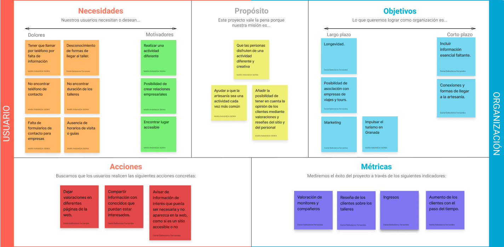
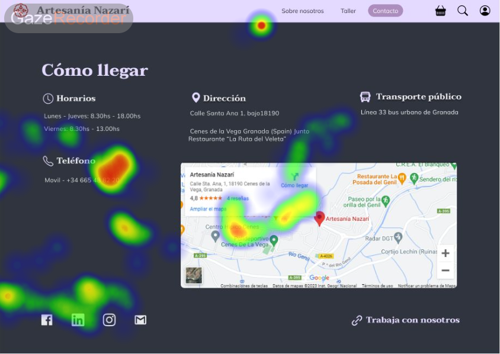

# DIU23
Prácticas Diseño Interfaces de Usuario 2022-23 (Tema: Artesanía Nazarí ) 

Grupo: DIU3_01Wachiturros.  Curso: 2022/23 
Updated: 24/03/2023

Proyecto: 
>>> Artesanía Nazarí

Descripción: 

>>> Nuestra propuesta se trata de una aplicación web que tiene como objetivo facilitar y esclarecer de la mejor manera posible la oportunidad de exponer e informar de las posibilidades que ofrecen talleres de Artesanía como el Nazarí. De esta manera se busca completar información esencial así como mejorar la presentación que se expone en la web original, dándole más accesibilidad y una cara más amigable cada vez que un nuevo visitante alcance la web de la empresa, así como incluir algunas funcionalidades que nos parece básicas para una web de la temática que se maneja, exprimiendo al máximo las posibilidades de la empresa.

Logotipo: 

Miembros
 * :bust_in_silhouette:   Daniel Ballesteros Fernandes     :octocat:     
 * :bust_in_silhouette:  María Rabaneda Sierra     :octocat:

----- 

# Proceso de Diseño 

## Paso 1. UX Desk Research & Analisis 

 1.a Competitive Analysis
-----

Si observamos las diferentes opciones de artesanía presentes en la ciudad, vemos como Artesanías Nazarí es una de las mejores, más aclamadas y que ofrecen más posibilidades entre las que se tienen en cuenta. Artesanías Nazarí ofrece más variedades, así como mejores servicios de manera aparente que su competencia. Por ello y por todos los apartados que se incluyen en la comparativa, resaltando la posibilidad de reservas, la información y las visitas, se toma como mejor opción las Artesanías Nazarí.
 

 1.b Persona
-----

**Jose Luis** es una persona interesante para poner en este contexto. Es un perfil moderno capaz de amoldarse a situaciones de la juventud de hoy día lo que puede ser interesante, de la mano con su condición de empresario.

La segunda persona creada es **Dolores**, una mujer de 67 años que vive en un pueblo y tiene una vida clásica y familiar. Creemos que es una buena elección, ya que es un perfil que no va a tener altos conocimientos en tecnología, y que además es mayor, por lo que puede tener unas limitaciones que no se suelen tener en cuenta.

 1.c User Journey Map
----

## Jose Luis
* Está interesado en abrir un espacio dentro de su agencia de viajes que incluya visitas a lugares de interés en Granada cuando mande a gente allá, sin embargo tiene problemas para contactar con la empresa por desconocimiento de alguna información que no aparece en el portal del taller, acabando nervioso. Creemos que es una situación capaz de darse más de una vez con alguien de su perfil.

## Dolores
* Lola lleva un tiempo sin viajar, y está organizando un viaje a Granada con sus amigas. Una de ellas propuso buscar algo relacionado con la artesanía. Todas estuvieron de acuerdo, y comenzaron su búsqueda por los sitios más famosos e interesantes. La situación de Lola tiene una parte que no es común, ya que las personas de más edad no suelen viajar solas, ni organizar viajes solas; pero por otro lado sí es común buscar las necesidades que se plantean con su personaje.

 1.d Usability Review
----
 - Enlace al documento:  [Link](https://drive.google.com/file/d/1SF2Jma2P_A_lChiHQG2X5fw2u0Ill52i/view?usp=sharing)
 - Valoración final (numérica): 51 - Moderate
 - Comentario sobre la valoración:  Como podemos observar, la valoración final ha sido de un 51/100, lo cual nos confirma lo ya comentado anteriormente, que tiene muchos fallos en cuanto a su diseño. Aún así, no es catastrófica, y lo hemos podido ver a la hora de compararla con otras páginas competidoras las cuales también dejan que desear. La interfaz web es un campo en este sector aún por explotar, y el cual no da buena imagen a las empresas, o al menos, la que deberían tener.

## Paso 2. UX Design  

 2.a Feedback Capture Grid / Empathy map / POV
----

>>> POV

 User | Need | Insight    
| ------------- | ------- | ----------
Hombre de 24 años con perfil de empresario. | Encontrar en la web alguna forma de comunicarse con la empresa. | El hombre busca una forma de ponerse en contacto con la artesanía como representante de su empresa para establecer algún tipo de negocio con ella, pero no encuentra una forma específica de hacerlo más que la opción existente abierta para todos los públicos.
Hombre de 24 años con perfil de empresario. | Encontrar los diferentes horarios que se ofertan para la guía turística en la Artesanía | El hombre trata de buscar los horarios de las visitas posibles para obtener más información del tiempo que duran las mismas y cada cuánto se hacen, pero no es capaz de verlo claramente ni siquiera simulando una reserva desde la web.
Mujer de 67 años jubilada y viajera. | Necesita que la página le proporcione información sobre cómo llegar al taller. Las conexiones de transporte público que existen para el sitio. | La usuaria necesita saber a ciencia cierta todas las posibilidades de transporte que hay tanto para llegar al sitio como para volver. En su plan de viaje necesitan saber horarios exactos para coger autobuses y poder volver a su pueblo tranquilas. Sin embargo, en la página web no aparece información de este estilo.
Mujer de 67 años jubilada y viajera. | Encontrar información sobre si existen o no facilidades para personas con discapacidades físicas. Por ejemplo para gente que use silla de ruedas o personas con discapacidades auditivas.  | Ella y su grupo de amigas pueden llegar a necesitar que el establecimiento donde se realizan los talleres sea accesible. Además, es importante que el servicio (wc)  sea adecuado, suficientemente amplio y esté cerca de donde van a realizar el taller. Es importante encontrar este tipo de información en la web, ya que es decisivo para que esta usuaria elija esta compañía.

  
    
>>> ¿Que planteas como "propuesta de valor" para un nuevo diseño de aplicación para economia colaborativa ?
>>> Problema e hipótesis

Nuestra propuesta se trata de una aplicación web que tiene como **objetivo facilitar y esclarecer** de la mejor manera posible la **oportunidad de exponer e informar de las posibilidades que ofrecen talleres de Artesanía** como el **Nazarí**. De esta manera se busca completar información esencial así como mejorar la presentación que se expone en la web original, dándole más accesibilidad y una cara más amigable cada vez que un nuevo visitante alcance la web de la empresa, así como incluir algunas funcionalidades que nos parece básicas para una web de la temática que se maneja, exprimiendo al máximo las posibilidades de la empresa.

Una de las funcionalidades que nos parece interesante implementar sería un sistema de valoraciones para incrementar la información disponible sobre los talleres. Dicha valoración se puede implementar en un apartado del menú de la web que disponga de una interfaz para mostrar los diferentes usuarios y monitores de la artesanía y así conocerlos mejor y ayudar a la elección de las sesiones.

Por otro lado, queremos presentar la misma idea anterior, pero aplicada al taller en general. Habría otro apartado en la página web, donde ver valoraciones del taller en sí. Así, surge el concepto de “reseñas”. Éstas, ayudarán a conocer mejor el taller, estando disponible en la web un apartado para conocer la opinión de los visitantes acerca del lugar y donde serán libres de comentar todo aquello que deseen siguiendo los códigos de conducta pertinentes.

Uno de los aspectos más importantes es el cómo llegar al taller, aspecto que no está por el momento muy claro. Se añadirá un apartado en la web que facilite formas de acceso mediante transporte al lugar donde se celebran los talleres y visitas, así como un formulario de contacto en el que se ofrecen guías turísticas por la ciudad llegando finalmente al destino.

 2.b ScopeCanvas
----

 2.b Tasks analysis 
-----

A partir de nuestro caso de estudio hemos razonado quiénes podrían ser potencialmente los principales tipos de clientes que acudirían a la web. Hemos identificado dos tipos principales: empresas y usuarios.

Los usuarios usarán la web con la finalidad de consultar información, así como gestionar y reservar por su cuenta aquello que le interese y gestionar personalmente sus acciones. Serán capaces de reservar visitas a la artesanía, buscar conexiones para llegar fácilmente al taller, dejar reseñas o contactar con la empresa. Dentro de éste grupo debemos distinguir dos categorías distintas:

Individuos, o grupos de pocas personas como familias pequeñas, fáciles de gestionar.
Grupos, como amigos, viajes del imserso... Grupos más grandes que requieren de mayor gestión y organización, dado que pueden ocupar la visita al taller en su completitud o casi.

Las empresas tendrán tareas distintas a los usuarios individuales, ya que estarán más familiarizadas con la empresa y el taller y facilitarán a otros usuarios o grupos información o reservas mediante un flujo algo diferente al del individuo. Dentro de este grupo destacamos:

Contratantes, siendo la parte de la empresa que funciona como intermediario entre la persona que asiste al taller y la artesanía.
Asistentes, siendo aquellas personas que hacen uso de la empresa para conocer  asistir al taller.

Haremos uso de una matriz de tareas dado que es más organizado y menos lioso para identificar los distintos grupos y hacer el análisis de las diferentes tareas que llevarán a cabo dentro de la web con la empresa del taller. En ella aparece la frecuencia de uso de cada usuario bajo la medida de:

H: High -
M: Medium -
L: Low

|  | Individuos | Grupos | Contratantes | Asistentes |
|:----------:|:----------:|:----------:|:----------:|:----------:|
| **Buscar información del taller**    | H   | H   |    |
| **Solicitar ayuda**    | L   | M   | M   |
| **Dejar reseña**       | M   | L   |     | L
| **Dejar valoración**   | M   | L   |     | M
| **Reservar visita**    | H   | M   | H   |
| **Cancelar visita**    | L   | M   | L   |
| **Cambiar visita**     | L   | M   | L   |
| **Modificar reserva**  | L   | M   | M   |
| **Reservar dinámicas de grupo**    | M   | H   |    | M
| **Guías turísticas**    | L   | M  |    | M

 2.c IA: Sitemap + Labelling 
----

| Etiqueta | Descripción |
|:----------:|:----------:|
| Home    | Página principal del sitio, se presenta la web de manera estándar.   
| Inicio Sesión    | Permite a los usuarios registrarse o acceder a su cuenta con el fin de poder usar la web más allá de las funcionalidades básicas.   
| Sobre Nosotros      | Muestra información sobre la artesanía, así como el taller.   
| Búsqueda  | Forma de navegar por la web mediante una búsqueda personalizada.   
| Tienda    | Tienda del taller, donde se ofrecen artesanías a la venta.   
| Perfil   | Información del usuario: nombre, correo, contraseña, feedback... Se puede configurar también aspectos como la interfaz, tamaño de texto…   
| Taller    | Taller de artesanía. Lugar en el que se puede gestionar todo lo referente a las visitas, actividades y valoraciones del lugar.   
| Contacto  | Formas de contacto con el taller.   
| Quiénes Somos   | Información más extensa recogida sobre el lugar, artesanos, monitores…   
| Reseñas    | Reseñas del lugar, referente al taller.  
| Mis Reservas    | Apartado de gestión de reservas de cada user, donde podrá modificarla, cancelarla…   
| Configuración      | Apartado configurable de cada usuario.   
| Mis valoraciones   | Feedback aportado por el usuario, ya sean valoraciones o reseñas.   
| Visitas    | Visitas a la artesanía y reservas para acudir.   
| Actividades    | Actividades gestionadas por el taller.   
| Fotos y Vídeos     | Galería que muestra el taller y lo que se hace en el lugar.   
| Valóranos  | Apartado para valorar el taller.   
| Cómo llegar    | Formas de llegar para mejorar la comunicación con la artesanía.   
| Trabaja con Nosotros    | Formulario para empresas externas a la artesanía interesados en trabajos conjuntos.   

 2.d Prototipo Lo-Fi Wireframes
-----

>>> Plantear el  diseño del layout para Web/movil (organización y simulación ) 

## Paso 3. Mi UX-Case Study (diseño)

 3.a Moodboard
-----

## Moodboard:

## Logotipo:

  3.b Landing Page

 3.c Guidelines
----

Tras un estudio diverso de los patrones recomendados y más usados, algunos que
consideramos son los que están aquí listados a continuación:

- *Filled Card*: Carta de presentación usada para el perfil del usuario una vez accedido a
su perfil personal para mostrar su información de manera limpia y ordenada.
- *Filled Button*: Botones que contrastan con la superficie para ser prominentes y captar
la atención del usuario. Tienen diversas acciones, como añadir al carrito en la tienda,
editar información…
- *Text button*: Botones que llaman menos la atención, dando importancia a otros
elementos. Se usan por ejemplo en el navegador del menú principal pues se busca
priorizar la imagen de la landing page que conforma el fondo.
- *Icon Button*: Botones de iconos que buscan dar información con una simple imagen y
una acción rápida, como por ejemplo, los botones de búsqueda o de acceso a la tienda.
- *Carousel*: Conjunto de ítems que pueden ser pasados de uno a otros dotándolos de una
presentación más limpia. Usada en el apartado de valoraciones de usuarios de la web
por ejemplo. Se han seguido las especificaciones y las guías aprovechando al máximo
el tamaño de la pantalla mostrando así contenido desplazable.
- *Divider*: Delgada línea que separa contenedores, por ejemplo vista en nuestro
apartado de la tienda.
- *Menus*: Menús desplegables para mostrar más información en un apartado, por
ejemplo, en el navegador.
7
- *Navigation bar+*: Una barra de navegación que nos muestra las diferentes opciones por
las que viajar en la web.
- *Search*: Forma de búsqueda rápida usando una palabra clave a lo largo de la web.
- *Tabs*: Tabs que organizan información en partes de la web, como se puede ver en el
perfil de cada usuario.
- *Text fields*: Campos de texto en los que se puede escribir, como puede ser en el
buscador.
- *Home Link*: Utilizamos el logo de la aplicación como enlace directo y desde cualquier
página a la página principal (Home). Este patrón afecta a toda la aplicación, haciendo
siempre accesible el home de la aplicación en cualquier momento.
- *Gallery*: Utilizamos amplias galerías de imágenes para mostrar los mismos a los
diversos usuarios.
- *Lazy Registration*: Permitimos que cualquier usuario que acceda a la app pueda
navegar sin ningún problema sin necesidad de registrarse. (Aunque se precisa de
hacerlo para más funcionalidades).
- *Canonical Layouts*: Usamos una lista vertical (que sigue especificaciones del carrusel)
para mostrar contenido el cual se puede inspeccionar. Clicando encima del contenedor
deseado, se desplegará información de interés para cualquier usuario. Diferenciamos
aquí un apartado como el área de listas, y otro como el área de detalles.

Además, nos hemos fijado en las recomendaciones de Material Design para nuestros mockups de
móvil. Por ejemplo, hemos respetado que haya un espaciado de 16 píxeles a cada lado de la pantalla.
- [Enlace a las recomendaciones vistas en Material Design](https://m3.material.io/foundations/layout/applying-layout/compact)

  3.d Mockup

 3.e ¿My UX-Case Study?
-----

Para el caso de estudio de nuestra aplicación, procederemos a facilitar un [video](https://drive.google.com/file/d/1a8KWVYeLyN3DoRkHZNeWks9Y2e_UtE1p/view?usp=share_link) en el que se muestra la aplicación, así como los diferentes user flows del que disponen los bocetos de alta calidad.
- [Enlace para visualizar el video](https://drive.google.com/file/d/1a8KWVYeLyN3DoRkHZNeWks9Y2e_UtE1p/view?usp=share_link)
- [Enlace Figma Layout HI-FI](https://www.figma.com/file/OXkhoL0cA7UdzeFmaw111N/Bocetos-Hifi?type=design&node-id=0%3A1&t=HzKr2obpAHxYhJ7n-1)
- [Enlace Figma Mockup HI-FI](https://www.figma.com/file/2KhaXOvFOiNnS51NrE5f00/Layout-Hi-fi-(Mockups)?type=design&node-id=0%3A1&t=KOnZHQURC7AKFPsy-1)

## Paso 4. Evaluación 

 4.a Caso asignado
----

En esta práctica se va a llevar a cabo una metodología para estudiar la Usabilidad del trabajo conocida como *“A/B Testing”*, un método para comparar 2 o más diseños en cuanto a sus prestaciones. Para ello, se distribuyen aleatoriamente a los usuarios en dos diseños, y se evalúa el resultado de cada uno (a través de cuestionarios o cualquier otro método de comparación). Es decir, usaremos como muestra nuestro proyecto *(A)* y el de un compañero de clase *(B).*

Por ello se nos va a asignar un caso B entre los disponibles de la clase como aparece en el repositorio [Asignación](https://github.com/mgea/DIU/blob/master/P4/Asignacion_ABtesting.pdf), siendo la asignación:

Usaremos el repositorio [DIU2.FelpudoMoreno](https://github.com/albertord98/DIU) en el desarrollo de esta práctica.

**Descripción Caso A:**
La aplicación A se refiere a la aplicación de Artesanía Nazarí, una web para una tienda/taller de artesanía que busca mantener la identidad de lo que supone la propia artesanía así como dar un lavado de cara y hacerla más amigable para el usuario. Se podrá descubrir y explorar la rica tradición artesanal de la cultura nazarí, que se remonta a la época medieval en Al-Andalus, así como preservar y promover estas técnicas ancestrales, que han sido transmitidas de generación en generación.

Los colores siguen una paleta de morados que intentan dar un ambiente tranquilo y sosegado, y con una familia de iconos clara. El mockups sigue una distribución instintiva que permite al usuario navegar sin problema por la web y volver al inicio siempre que quiera, dándole versatilidad.

**Descripción Caso B:**
La aplicación B es una app de recomendaciones de lugares para comer. En ella se podrá buscar y catalogar el tipo de comida también basado en la cercanía (GPS) para encontrar el mejor lugar para comer siguiendo las directrices colocadas en la aplicación. De esta manera se podrá dar una herramienta para encontrar una mayor cantidad de lugares de provecho así como fomentar el turismo en la ciudad y compartir valoraciones de cada establecimiento.

Respecto a la paleta de colores, cabría decir que han tenido en cuenta el contraste de los usados en favor de personas con algún problema visual. Las tonalidades son llamativas a la par que apacibles por lo que llaman la atención sin ser una molestia para la vista, cosa que se agradece.

Además, el mockup de la aplicación se sigue bien de forma intuitiva y tiene una interfaz clara a los usuarios. Se podría haber mejorado siguiendo algunos guidelines de google bastante intuitivos, como el carousel para ganar espacio de pantalla o hacer mejor visible el menú.

 4.b User Testing
----

Para el desarrollo de la práctica se usará el método de Role Playing, y se crearán 4 perfiles ficticios de manera aleatoria siguiendo las indicaciones de la guía de la práctica. Así se crearán 4 usuarios que representarán a las personas que acceden a la aplicación. (2 para la aplicación A, y 2 para la B).

- **Persona A** → (1, 6, 5.) Javier es un profesor de pilates de 26 años de edad, bastante tranquilo y espiritual. Tiene un nivel intermedio en el manejo de tecnologías con el que se puede defender, aunque a pesar de ello reniega bastante de ellas, disgustándole.

- **Persona B** → (4, 5, 3.) Alberta es una persona mayor de 65 años, jubilada. A pesar de disponer de una discapacidad física debido a un accidente en el que perdió una pierna, no le gusta limitarse y le encanta viajar, siendo feliz así.

- **Persona C** → (2, 4, 6.) Luis es un abogado, padre de familia, cuyo día a día es un constante ajetreo por su trabajo, labores del hogar y crianza de sus hijos. Se siente algo triste por su falta de tiempo libre.

- **Persona D**→ (5, 1, 1.) Marta es una joven empresaria de 33 años de edad. A pesar de estar absorta en su trabajo, disfruta mucho moviéndose y pasar los domingos en el campo o la montaña. Está cabreada con el aumento de los precios recientemente de cara a sus vacaciones.

| Usuarios | Sexo/Edad     | Ocupación   |  Exp.TIC    | Personalidad | Plataforma | TestA/B
| ------------- | -------- | ----------- | ----------- | -----------  | ---------- | ----
| Javier  | H / 26 | Profesor de Pilates | Intermedio  | Amargado     | Móvil.     | A 
| Alberta | M / 65 | Jubilada            | Bajo        | Feliz        | Web.       | A 
| Luis    | H / 45 | Abogado             | Bajo        | Emocional    | Móvil.     | B 
| Marta   | M / 33 | Empresaria          | Avanzada    | Temperamental| Web.       | B 

. 4.c Cuestionario SUS
----

En este apartado se realizarán diversas encuestas de usuario para conocer mejor el impacto de la aplicación en diferentes perfiles. Se usará el “Sistema de Escalas de Usabilidad (SUS)” para medir la usabilidad del mismo y establecer una valoración orientativa para saber cómo encauzar el proyecto.

Se trata de un método «rápido y sucio» para evaluar la usabilidad de cualquier sistema. Desarrollado por John Brooke en 1986, cuando trabajaba en Digital Equipment Corporation, una empresa americana que fue pionera en la fabricación de microcomputadores. El SUS lleva usándose más de 30 años y permite hacer una evaluación de:

- **Eficacia:** ¿los usuarios pueden alcanzar con éxito sus objetivos? 
- **Eficiencia:** ¿cuánto esfuerzo es necesario para que pueda alcanzar esos objetivos?
- **Satisfacción:** ¿el uso del sistema fue satisfactorio? 

Al contrario que otros métodos de investigación, este ya tiene los enunciados predefinidos y es fácil de calcular el resultado final. De cara a quien contesta también es muy breve, porque para contestar no es necesario redactar las respuestas ni invertir demasiado tiempo descifrando el enunciado

El SUS consta de 10 enunciados predefinidos, presentes en las tablas posteriores que se adjuntará en cada entrega, y las respuestas a cada enunciado se piden siguiendo la Escala de Likert (presente también en la tabla). El resultado se obtiene realizando unas cuentas matemáticas que ofrecen un valor entre 0 y 100. Un estudio realizado en más de 500 webs y aplicaciones concluye que el puntaje promedio es 68 y un resultado por debajo de esta cifra indica que hay varios aspectos a corregir.

Tras obtener el resultado SUS de cada valoración, se obtiene una media aritmética de **82.5** para la **App A**, y de **77.5** para la **App B**, con lo que siguiendo la escala expuesta con anterioridad podemos decir que es un resultado aceptable al ser valores superiores a 68, que es el puntaje promedio a partir del cuál estipulamos que el resultado es aceptable, es decir, se va por el buen camino.

Para la elaboración del cuestionario SUS, se ha intentado imaginar cómo los diferentes roles se aplican teniendo en cuenta los conocimientos, estados de ánimos o situación, para representar al máximo posible una situación real, por ende los resultados pueden estar influenciados por el tipo de usuario que puntúe la aplicación, siendo algo orientativo.

Los resultados de Artesanía Nazarí se deben a que hemos intentado realizar una aplicación cohesionada, simple e intuitiva. El arte y la ambientación agasaja a aquellos que entran en la web, quedándose prendados por su sencillez y por las opciones que ofrece, descubriendo un mundo completamente nuevo. Tanto usuarios experimentados como novatos pueden moverse sin problema usando las opciones que la misma proporciona.

La aplicación B a pesar de tener resultados inferiores a la A, cuenta con una puntuación aún aceptable. Se destaca la sencillez y la utilidad de la misma, aunque las ideas presentadas son algo redundantes con otras en el mercado. A pesar de que el contraste ayuda a las personas con problemas visuales, el color puede resultar poco atractivo para cierto público.

Ambas aplicaciones son difíciles de comparar, pues tratan temas diferentes siendo uno, la Artesanía Nazarí, y el segundo, una aplicación para encontrar el lugar perfecto para comer. Ambas tienen sus puntos fuertes y débiles, aunque los usuarios ficticios han preferido la aplicación A en términos generales, quizás por la presentación y el seguimiento de los guidelines adecuados.

 4.d Usability Report
----

Evaluación de usabilidad de la aplicación B. Hemos creado un mini-informe con los datos obtenidos para la aplicación B del A/B testing y así como recomendaciones de mejoras. En él se encuentra un análisis que incluye una descripción del website, un resumen sobre cómo hemos procedido, la metodología que hemos utilizado, de nuevo los perfiles de los usuarios, y finalmente unos apartados que contienen los resultados de las evaluaciones, junto con nuestras conclusiones y recomendaciones.

### Descripción del Website

RestaurApp se trata de una página turística para la recomendación de los mejores lugares para comer y cenar en tu ciudad. La página principal contará con una barra de búsqueda y un selector del tipo de comida que le apetece al usuario. Una vez seleccionada, se le mostrarán las opciones mejor valoradas alrededor de su zona.

También existirá un mapa de la ciudad que mostrará los restaurantes por ubicación.

### Resumen ejecutivo.

El propósito principal de este informe es examinar y detectar las deficiencias de la aplicación en términos de usabilidad, llevando a cabo una prueba de usabilidad mediante la participación de diversos tipos de usuarios en la interacción con el sistema. Para este fin, se usará el método de Role Playing, y se crearán 4 perfiles ficticios de manera aleatoria siguiendo las indicaciones de la guía de la práctica. Así se crearán dos usuarios que representarán a las personas que acceden a la aplicación (aparecerán como usuarios C y D ya que los usuarios ficticios A y B estaban asignados a evaluar nuestra aplicación, no la que estamos evaluando en este report):

- **Persona C** → (2, 4, 6.) Luis es un abogado, padre de familia, cuyo día a día es un constante ajetreo por su trabajo, labores del hogar y crianza de sus hijos. Se siente algo triste por su falta de tiempo libre.

- **Persona D** → (5, 1, 1.) Marta es una joven empresaria de 33 años de edad. A pesar de estar absorta en su trabajo, disfruta mucho moviéndose y pasar los domingos en el campo o la montaña. Está cabreada con el aumento de los precios recientemente de cara a sus vacaciones.

A través de esta prueba, se han identificado algunos defectos que se abordarán en detalle más adelante. Este informe proporciona información sobre la reacción de los usuarios después de interactuar con el sistema, la complejidad de las tareas realizadas, los errores identificados y las recomendaciones para mejorarlo.

### Metodología

Al llevar a cabo el test de usabilidad, el primer paso ha sido identificar usuarios realistas para evaluar la aplicación. Una vez que los usuarios han sido identificados, determinaremos cómo interactuarán con la aplicación al realizar diversas tareas. Para cada tarea planteada, se asigna un valor numérico del 1 al 5, teniendo en cuenta los siguientes aspectos:

- La facilidad de encontrar la información solicitada desde la vista principal.
- La precisión al predecir en qué sección de la aplicación se encuentra la información.
- La capacidad de identificar en qué punto del sistema se encuentran.

Una vez completada esta etapa, los usuarios deben responder a un cuestionario SUS con el objetivo de obtener una evaluación global de la aplicación. Gracias a  esta última tarea, se han extraído una serie de conclusiones en relación a:

- Los defectos en la interfaz de la aplicación.
- Qué contenido resultó más interesante para cada usuario.
- Las recomendaciones de mejora.

#### Participantes

| Usuarios | Sexo/Edad     | Ocupación   |  Exp.TIC    | Personalidad | Plataforma | TestA/B | SUS Score 
| ------------- | -------- | ----------- | ----------- | -----------  | ---------- | ------- | --------
| Luis    | H / 45 | Abogado             | Bajo        | Emocional    | Móvil.     | B       | 67.5
| Marta   | M / 33 | Empresaria          | Avanzada    | Temperamental| Web.       | B       | 87.5

#### Evaluación de tareas /escenarios

A continuación, hemos analizado la realización de diferentes tareas por parte de cada uno de los usuarios definidos anteriormente:
1. Buscar un restaurante concreto.
2. Llegar al perfil de usuario.
3. Ver restaurantes populares.
4. Acceder a una red social vinculada.
5. Visualizar el mapa con los distintos restaurantes.
6. Poner una valoración del sitio.

#### Cuestionario SUS

Para la elaboración del cuestionario SUS, se ha intentado imaginar cómo los diferentes roles se aplican teniendo en cuenta los conocimientos, estados de ánimos o situación, para representar al máximo posible una situación real, por ende los resultados pueden estar influenciados por el tipo de usuario que puntúe la aplicación, siendo algo orientativo.

*1. Totalmente en desacuerdo*
*2. En desacuerdo*
*3. Neutro*
*4. De acuerdo*
*5. Totalmente de acuerdo*

#### Conclusión

Tras obtener el resultado SUS de cada valoración, se obtiene una media aritmética de 77.5 para la App B, con lo que siguiendo la escala expuesta con anterioridad podemos decir que es un resultado aceptable al ser una valoración superior a 68, que es el puntaje promedio a partir del cuál estipulamos que el resultado es aceptable, es decir, se va por el buen camino.

La aplicación B cuenta con una puntuación aún aceptable. Se destaca la sencillez y la utilidad de la misma, aunque las ideas presentadas son algo redundantes con otras en el mercado. A pesar de que el contraste ayuda a las personas con problemas visuales, el color puede resultar poco atractivo para cierto público.

Respecto a la paleta de colores, cabría decir que han tenido en cuenta el contraste de los usados en favor de personas con algún problema visual. Las tonalidades son llamativas a la par que apacibles por lo que llaman la atención sin ser una molestia para la vista, cosa que se agradece.

Además, el mockup de la aplicación se sigue bien de forma intuitiva y tiene una interfaz clara a los usuarios. Se podría haber mejorado siguiendo algunos guidelines de google bastante intuitivos, como el carousel para ganar espacio de pantalla o hacer mejor visible el menú.

>>> ## Paso 5. Evaluación de Accesibilidad  (no necesaria)

>>>   5.a Accesibility evaluation Report 
>>>> ----

Se desea comprobar si el diseño (prototipo) que se ha realizado en las prácticas cumple con las
expectativas de cara a su desarrollo. Para ello, es importante que el usuario identifique los puntos claves de la página y sepa cómo realizar las tareas. Para ello, realizaremos un experimento (nuevo caso de estudio) en el que comprobaremos cómo se identifican y reconocen las partes más destacadas nuestro proyecto, ya sea como una aplicación (web) o con imágenes

Se hará uso de la herramienta GazeRecorder para poder realizar un seguimiento, y obtener un posterior mapa de calor para identificar las zonas en las que se ha centrado más la vista del usuario objetivo. Así podremos identificar las zonas más llamativas de la aplicación así como dónde la visión del objetivo se mueve a la hora de interpretar nuestro trabajo.

Para realizar este estudio, hemos establecido tres tareas (o supuestos) para que el usuario se meta en el papel de dicha situación para así interpretar con mayor precisión los datos obtenidos por el estudio:

1. Acceder a las valoraciones de la web.
2. Comprar un producto.
3. Explora la web y mira lo que más te llama la atención.

>>> 5.a) Usuario Ajeno a la Aplicación

>>> 5.b) Usuario familiarizado con la aplicación

>>> 5.c) Conclusiones

Se han presentado las capturas a los usuarios de algunas páginas de la aplicación. Las directivas de las mismas fueron, en algunas capturas, buscar la forma que entendería el usuario de acceder a las valoraciones de la web, comprar un producto o explorar la web y mirar lo que más le llama la atención. Todo ello se hizo con la supervisión en persona de uno de los dos miembros del grupo, siendo guiados en todo momento los sujetos de prueba.

Como podemos observar en las capturas de pantalla adjuntadas, se diferencia claramente cómo el usuario que realmente está familiarizado con la aplicación, detecta mucho más fácilmente los puntos de interés (AOI) de la aplicación. Vemos cómo se va directamente a la zona de valoración, o a la tienda, a los puntos importantes que queríamos evaluar en esta práctica. Mientras que, analizando a un usuario ajeno a este proyecto, vemos cómo el mapa resulta más disperso, por tanto concluyendo que le cuesta un poco más identificar los puntos fuertes. Aún así, también vemos en el resultado, que al final también es capaz de identificarlos, aunque sea con menos intensidad o menos tiempo dedicado a observarlos.

Cabe destacar que aunque el usuario experimentado sabe identificar con mayor rapidez, y por ende, mayor precisión los lugares propuestos como casos de estudio, el usuario no tan familiarizado también es capaz de identificar dichos puntos con el suficiente tiempo, lo que nos puede decir que nuestra web es suficientemente clara y concisa así como intuitiva de cara a los nuevos visitantes que la ven por primera vez.

Algunos puntos de interés que apenas han recibido tiempo de visión puede ser, por ejemplo, el logo de la web. El mismo se supone que es una marca identificativa de la aplicación, y puede ser comprensible que el usuario familiarizado no se fije en él ya que tiene en mente cuál es su objetivo. El usuario ajeno apenas ha dedicado tiempo a él, lo que nos puede llevar a pensar que no es suficientemente llamativo o amigable.

## Conclusión final / Valoración de las prácticas

Durante el curso nos hemos acercado al proceso de desarrollo de diseño siguiendo la metodología UX y a la industria del diseño de interfaces. Esta metodología pone énfasis en comprender las necesidades de los usuarios y en crear experiencias satisfactorias y eficientes. Al seguir este enfoque, se fomenta la empatía con los usuarios, lo que puede conducir a la creación de interfaces intuitivas y atractivas, siendo factores clave para este campo del desarrollo web.

Los conocimientos obtenidos de la asignatura de DIU son bastante positivos, pues hemos aprendido:

1. Cumplimiento de los objetivos del usuario: Si el diseño de la interfaz satisface las necesidades y expectativas de los usuarios de manera efectiva.
2. Usabilidad y facilidad de uso: Si la interfaz es intuitiva, fácil de aprender y de usar. La navegación clara, la estructura lógica de la información y la capacidad de realizar tareas sin dificultad.
3. Retroalimentación y evaluación de los usuarios: Si los diseños se someten a pruebas con usuarios reales y se recopila retroalimentación significativa, y se utilizan estos hallazgos para mejorar y refinar el diseño.

En resumen, hemos logrado absorber una gran cantidad de experiencia en el desarrollo, así como dar un paso en el proceso creativo real de una página web, abriéndonos un mundo de infinidad de opciones a descubrir.

